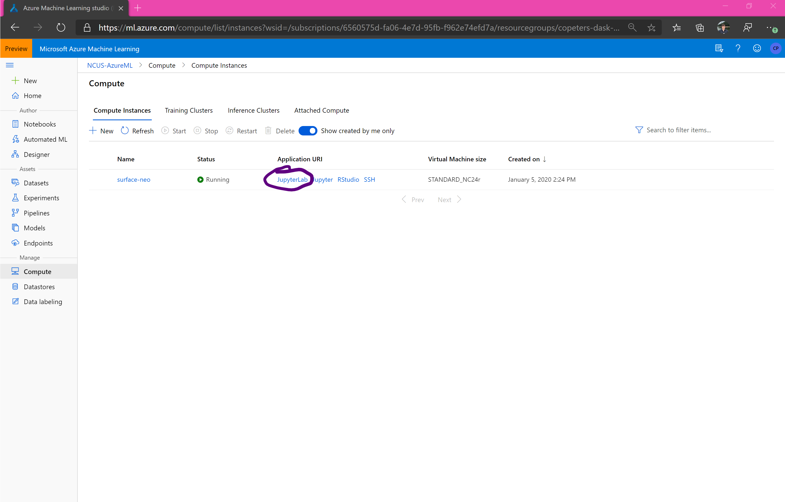
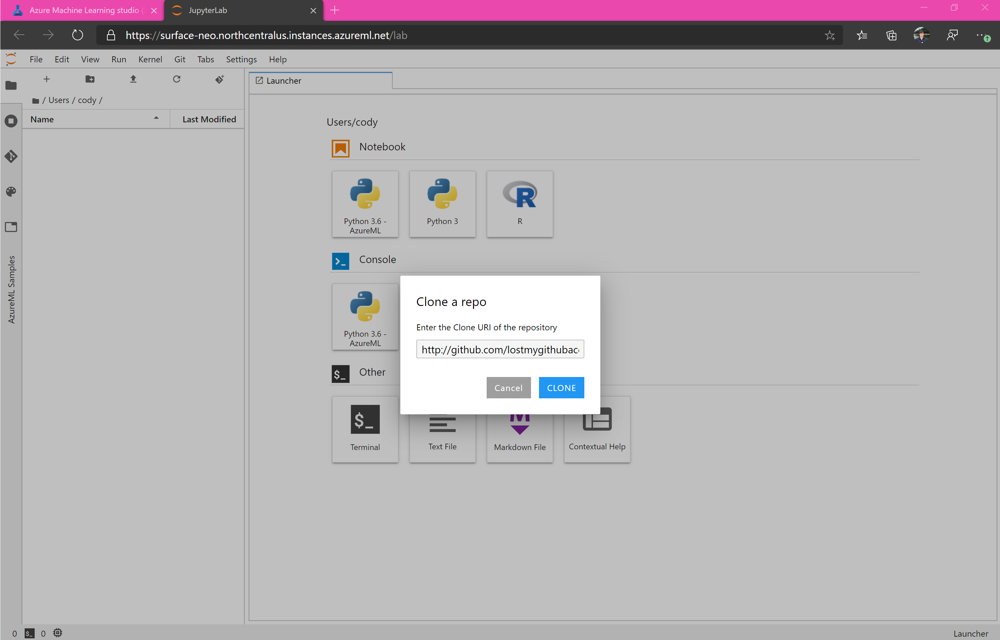

forked from https://github.com/danielsc/azureml-and-dask

# Azure ML and Dask 

## Introduction

Dask + Azure ML = OSS Data Science @ Scale.

## Data overview

The data is a copy of the [NOAA Integrated Surface Data (ISD)](https://azure.microsoft.com/services/open-datasets/catalog/noaa-integrated-surface-data/) moved from [Azure Open Datasets](https://azure.microsoft.com/services/open-datasets/catalog/) to an ADLS Gen 2 filesystem for distributed processing. 

It is stored in compressed parquet files and uncompressed CSV files which are ~8 GB and ~150 GB respectively. There are ~130 individual files. Loaded in a dataframe, the data occupies ~700 GB. 

## Create a virtual network 

Create or use an existing virtual network (vNET). Both the interface for the Dask cluster and the cluster itself will be in the virtual network. You can quickly create one in the [Azure Portal](https://docs.microsoft.com/en-us/azure/virtual-network/quick-create-portal) or [Azure CLI](https://docs.microsoft.com/en-us/azure/virtual-network/quick-create-cli) if you do not have one already.

**Warning**: You may need to change the vNET resource group and name in the configuration cell.

## Create and setup compute instance 

Create an Azure ML Compute Instance in the vNET you have created.

**Important**: Your workspace must be in *North Central US* or *UK South* due to Compute Instance availability. They will be available in all regions in early February. 

**Warning**: With default subscription quotas, you may not be able to run the notebook as-is. Check your subscription's quota in the region and calculate the maximum size cluster you can use. The default cluster created in this notebook is about the minimum needed to work with the data very quickly without repartitioning, but smaller clusters will work. Do not persist the dataframe on smaller clusters, this will harm performance.

## Launch JupyterLab or Jupyter

Launch JupyterLab (recommended) or Jupyter from the list of URIs. 

## Clone repository

You can use the terminal or UI to clone https://github.com/lostmygithubaccount/dasky.git.

