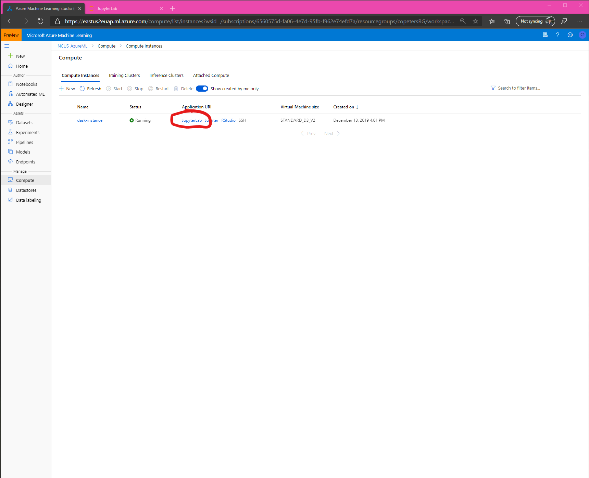
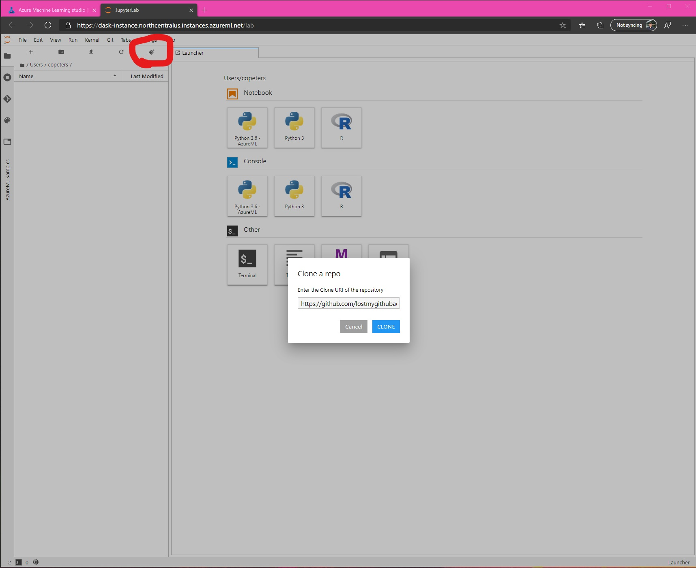

# Fun with Azure ML and Dask 

## Introduction

blah blah blah

## Create cluster and compute instance

We will create an Azure ML compute cluster and compute instance. The instance will be our interface with the cluster, where we will set it up and send it commands through a Jupyter notebook. Both will be placed in the same Azure virtual network. If you do not already have a virtual network, you can [easily create one](https://docs.microsoft.com/azure/virtual-network/quick-create-portal#create-a-virtual-network) using default settings. Having both the Jupyterlab interface and dask cluster in the same virtual network allows for easy connection between the two and increased security through firewalls and other features. 

First, let's setup the Azure ML cluster. It is recommended to use `STANDARD_DS12_v2` or similar sized. For this example, I'll use a cluster with 20 nodes. Make sure to configure the cluster in the virtual network and create a username and password/SSH key as shown below. The login information will be used to setup port forwarding between the instance and the cluster, which is optional but highly recommended to connect to the dask dashboard.


Next, let's setup the compute instance. Since this compute will not be doing much work, any size machine is fine. Again, make sure to place it in the same virtual network as the cluster. This will take a few minutes to create and setup. 

If using JupyterLab, click on the button to clone a git repo. The repo we will clone is hosted at https://github.com/lostmygithubaccount/dask-examples.git. Copy this link and clone the repo. 



Once ready, you will have a link to open Jupyter or JupyterLab (recommended). Click one of the links.



Open up `StartDask.ipynb`. 

## Setup cluster

In a notebook:

```python
from azureml.core import Workspace, Experiment
from azureml.widgets import RunDetails
from azureml.core.runconfig import RunConfiguration, MpiConfiguration
from azureml.train.estimator import Estimator

ws = Workspace.from_config()
ct = ws.compute_targets['dask-cluster']

est = Estimator('dask', 
                compute_target=ct, 
                entry_script='startDask.py', 
                conda_dependencies_file='environment.yml', 
                script_params={'--datastore': ws.get_default_datastore()},
                node_count=50,
                distributed_training=MpiConfiguration())

run = Experiment(ws, 'dask').submit(est)

RunDetails(run).show()
```


## Connect to cluster

Start the cluster

```python
from dask.distributed import Client

c = Client(f'tcp://{headnode}:8786)
c
```

Optionally, run the output of the following in a terminal on the compute instance:

```python
print(f'ssh daskuser@{headnode} -L 8788:{headnode}:8787')
```

You will need the password you setup for the SSH account on the cluster. This will forward the Dask dashboard bokeh app to the compute instance. You can access it at `https://{compute_instance}-8788.{region}.instances.azureml.net/status`. For example, with my compute instance named `dask-instance` in region `northcentralus` the link https://dask-instance-8788.northcentralus.instances.azureml.net/status works.


Wow, a cluster with 2.3 TB of memory and 320 cores!!! This is where the fun begins.

## Getting data

Let's get some data.

## Exploring the data

